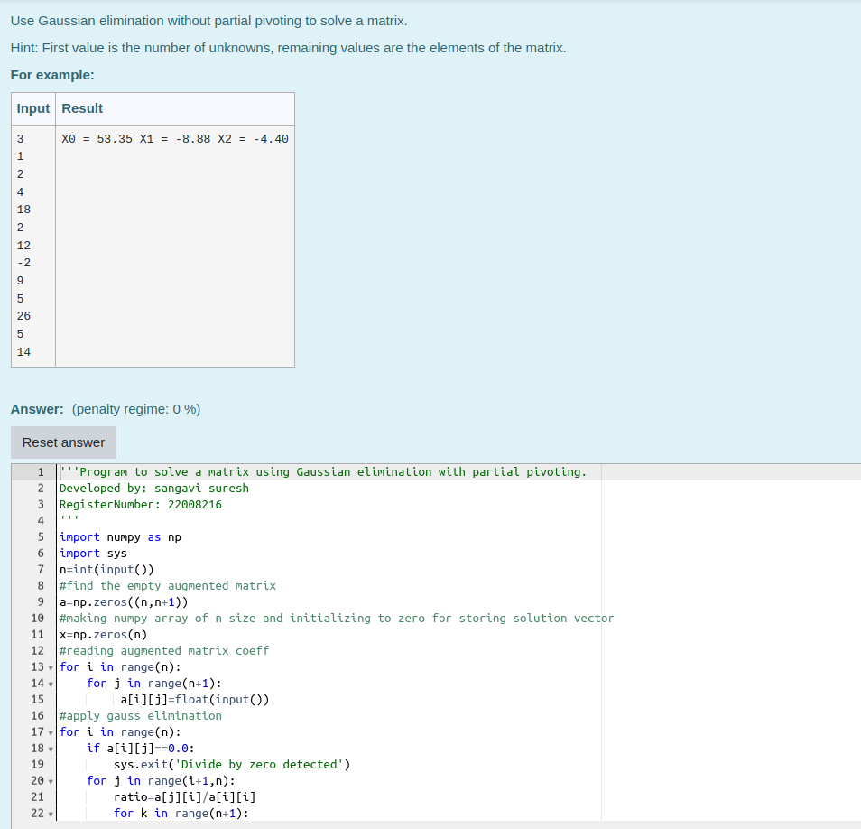
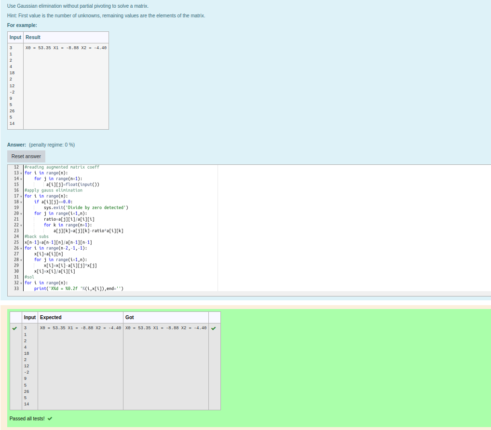

# Gaussian Elimination

## AIM:

To write a program to find the solution of a matrix using Gaussian Elimination.

## Equipments Required:

1. Hardware – PCs
2. Anaconda – Python 3.7 Installation / Moodle-Code Runner

## Algorithm
1. import numpy as np

2. import sys

3. get the input from the user for number of rows and add it by 1 for number of column

4. using nested for loop

5.use back substitution method to find the value of variables

6.print the output

## Program:
```python
Program to find the solution of a matrix using Gaussian Elimination.
Developed by: sangavi suresh
RegisterNumber: 22008216

import numpy as np
import sys
n=int(input())
#find the empty augmented matrix
a=np.zeros((n,n+1))
#making numpy array of n size and initializing to zero for storing solution vector 
x=np.zeros(n)
#reading augmented matrix coeff
for i in range(n):
    for j in range(n+1):
         a[i][j]=float(input())
#apply gauss elimination 
for i in range(n):
    if a[i][j]==0.0:
        sys.exit('Divide by zero detected')
    for j in range(i+1,n):
        ratio=a[j][i]/a[i][i]
        for k in range(n+1):
            a[j][k]=a[j][k]-ratio*a[i][k]
#back subs
x[n-1]=a[n-1][n]/a[n-1][n-1]
for i in range(n-2,-1,-1):
    x[i]=a[i][n]
    for j in range(i+1,n):
        x[i]=x[i]-a[i][j]*x[j]
    x[i]=x[i]/a[i][i]
#sol
for i in range(n):
    print('X%d = %0.2f '%(i,x[i]),end='')
```

## Output:



## Result:

Thus the program to find the solution of a matrix using Gaussian Elimination is written and verified using python programming.

